# Lab — Generative AI and Software Engineering

## From a Google Spreadsheet to a Reusable AI Agent Skill

In this lab you will connect Python to Google Sheets, build two small command‑line tools to read and write spreadsheet data, document those tools with `showboat`, and finally package everything as a reusable **Agent Skill** that an AI coding assistant can invoke on its own.

The exercises emphasise a workflow that is becoming standard in modern software engineering: **prompt → generated code → manual verification → refinement of the prompt or skill**. By the end of the lab you should have a clear sense of how to capture a small automation as a skill that you (and your AI assistant) can reuse across projects.

---

## 1. Create the Google Spreadsheet

Create a new Google Spreadsheet named **`Skills`** with three columns: `Email`, `Student`, `URL`. Use the template shown below as a reference:

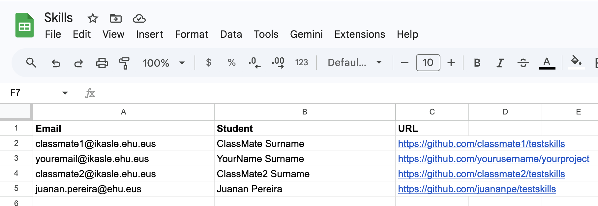

Populate the sheet with the following rows:

- **Your own data**: your email, your name and surname, and the URL of one of your GitHub projects.
- **Two of your classmates**: same three fields for each of them.
- **The teacher**: email, name/surname, and the repository <https://github.com/juananpe/testskills>.

Make sure that you have **read access** to every GitHub repository you list — either because you have been invited as a collaborator or because the repository is public.

---

## 2. Create a Google Service Account

To automate any process on a Google Spreadsheet from a script, you need a **Service Account**: a non‑human Google identity that your code can use to authenticate. Once it is created, you will share the spreadsheet with the service account just as you would share it with another person.

You can either use an AI assistant to walk you through it (for example, the prompt below with the Playwright MCP tool) or do it manually through the Google Cloud Console.

> **Suggested prompt**
> *"I want to create a service account in Google so that I can share a spreadsheet with it and automate some processes. Use #playwright to guide me through the process."*

The manual route is also straightforward:

1. Create (or select) a project in Google Cloud.
2. Open the Service Accounts page:
   `https://console.cloud.google.com/iam-admin/serviceaccounts?project=XXXXXX`
3. Create a new service account.

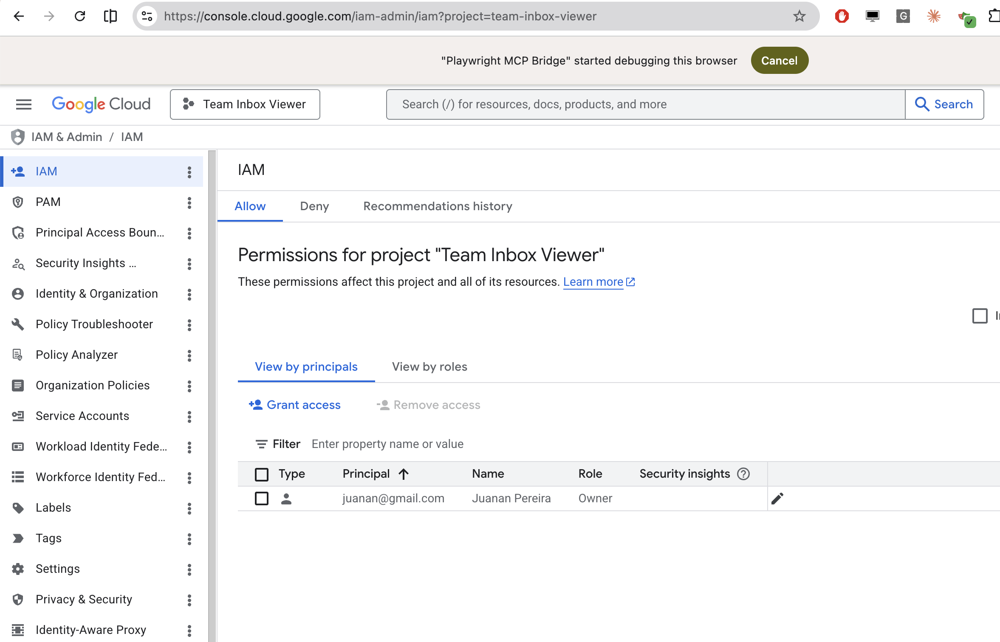

Then open the **Keys** tab of your new service account and create a new key of type **JSON**. Download the file — this is the credential your script will use.

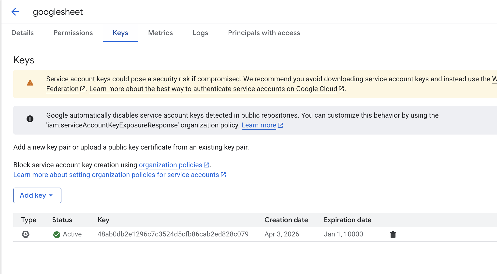

> ⚠️ **Treat the JSON key file as a secret.** Never commit it to a Git repository. Add it to your `.gitignore` immediately.

---

## 3. Share the Spreadsheet with the Service Account

Open your spreadsheet in Google Sheets and click **Share**. Add the **email address of the service account** as an **Editor**. The address is shown in the Google Cloud Console and looks like a regular Gmail address but ends in `iam.gserviceaccount.com` — for example:

```
sheets-automation-bot-20260424@team-inbox-viewer.iam.gserviceaccount.com
```

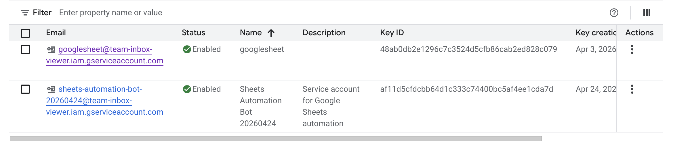

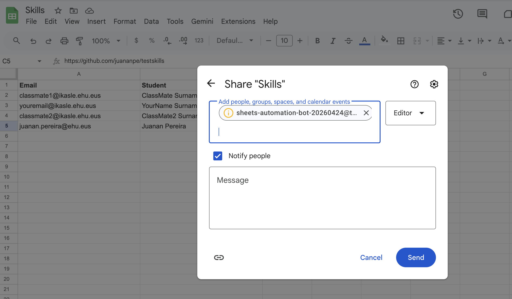

From this point on, the service account can read and write the sheet exactly like any other editor.

---

## 4. Build `read_sheet.py`

Use the following prompt to generate a small CLI tool that reads a column from a Google Sheet:

> **Prompt — `read_sheet.py`**
>
> Write a Python CLI script called `read_sheet.py` that reads values from a specific column of a Google Sheet.
>
> **Requirements**
> - Use the `gspread` library, authenticating with a service‑account file at `service-account.json` in the current directory.
> - Accept the spreadsheet ID via a required `--spreadsheet-id` CLI argument.
> - CLI arguments (use `argparse`):
>   - `--spreadsheet-id` (required): Google Sheet ID to read from.
>   - `column` (required, positional): column letter, for example `A`, `I`.
>   - `worksheet` (optional, positional): worksheet/tab name. If omitted, use the first sheet.
>   - `--json` (flag): output as JSON instead of plain text.
> - Fetch values with `worksheet.col_values(col_idx)`.
> - Return a list of `(row_number, value)` tuples. Row numbers are 1‑indexed.
> - Include a row in the output only if it has a non‑empty value.
> - Output:
>   - Default: one row per line, formatted as `{row}: {value}`.
>   - `--json`: a JSON array of objects with keys `row` and `value`, pretty‑printed with `indent=2`.
> - Put the core logic in a reusable function `get_column_values(spreadsheet_id, column_letter, worksheet_name=None)` and keep the `argparse` wrapper in a separate `main()`.
>
> Generate the corresponding `requirements.txt` and the commands needed to install and run the script. Also give me a list of example commands I can try.

The assistant should produce `read_sheet.py` and a `requirements.txt` that contains:

```
gspread
```

The spreadsheet ID is the long alphanumeric string in the Google Sheets URL:

```
https://docs.google.com/spreadsheets/d/SPREADSHEET_ID/edit
```


### Installation

On macOS or Linux:

```bash
python3 -m venv .venv
source .venv/bin/activate
pip install -r requirements.txt
```

On Windows PowerShell:

```powershell
python -m venv .venv
.venv\Scripts\Activate.ps1
pip install -r requirements.txt
```

### Required file layout

```
your-project/
├── read_sheet.py
├── requirements.txt
└── service-account.json
```

---

## 5. Build `write_sheet.py`

Reuse the same workflow to generate a writing tool:

> **Prompt — `write_sheet.py`**
>
> Write a Python CLI script called `write_sheet.py` that writes a value to a specific cell of a Google Sheet.
>
> **Requirements**
> - As before, use `gspread` authenticating with `service-account.json` in the current directory.
> - Accept the spreadsheet ID via a required `--spreadsheet-id` CLI argument.
> - CLI arguments (use `argparse`):
>   - `--spreadsheet-id` (required): Google Sheet ID to write to.
>   - `column` (required, positional): column letter, for example `A`, `I`.
>   - `row` (required, positional, int): 1‑indexed row number.
>   - `value` (optional, positional): value to write. If omitted, only the background formatting should be changed — do not overwrite the existing cell value.
>   - `worksheet` (optional, positional): worksheet/tab name. If omitted, use the first sheet.
> - Behaviour:
>   - Build the A1‑style cell address (for example `I5`) from the column letter and row number.
>   - If `value` is not `None`, write it with `worksheet.update(range_name=<addr>, values=[[value]])`.
> - Put the core logic in a reusable function `write_cell_value(spreadsheet_id, column_letter, row_number, value, worksheet_name=None)` and keep the `argparse` wrapper in a separate `main()`.
> - After writing, print a confirmation such as `Written to cell I5`.

---

## 6. Document the Scripts with `showboat`

Once both scripts work, you will document them with **`showboat`**, a small tool that turns CLI commands into runnable Markdown documentation.

Create and activate a virtual environment and install `showboat`:

```bash
python3 -m venv .venv
source .venv/bin/activate
pip install showboat
```

Then ask your AI assistant:

> **Prompt**
> *Read `@file:read_sheet.py` and `@file:write_sheet.py`. Run `showboat --help` and then use `showboat` to create a `demo.md` document describing the features of those two commands.*

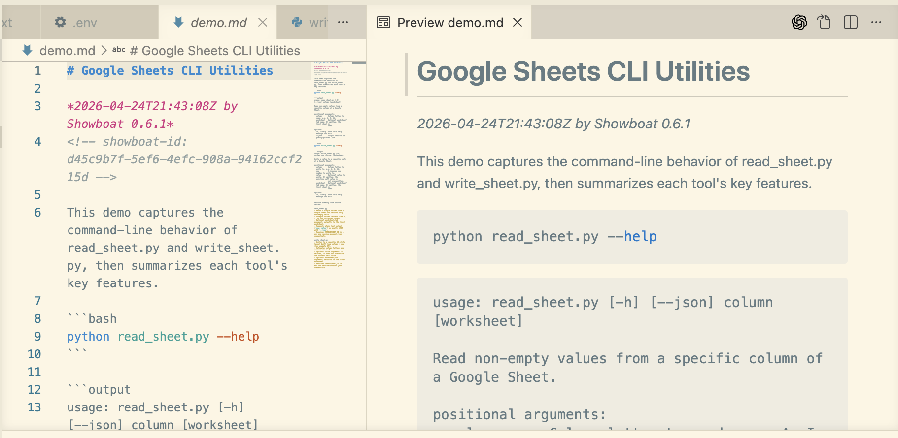

### Document `read_sheet` reading column A

> **Prompt**
> *Run `showboat` with `read_sheet` to show column A values.*

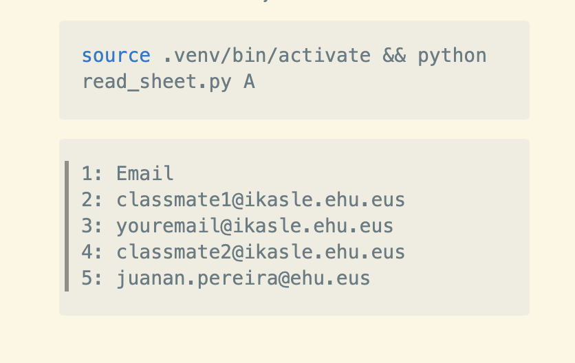

### Document `read_sheet` reading a single cell

> **Prompt**
> *Now use `showboat` to run the `read_sheet` script to show A2.*

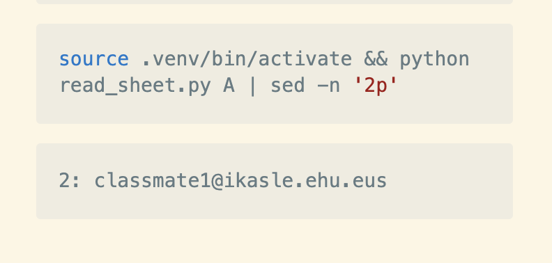

### Document a write operation

> **Prompt**
> *Use `showboat` to document how to write the value `studentA6` in cell A6 using `write_sheet.py`.*

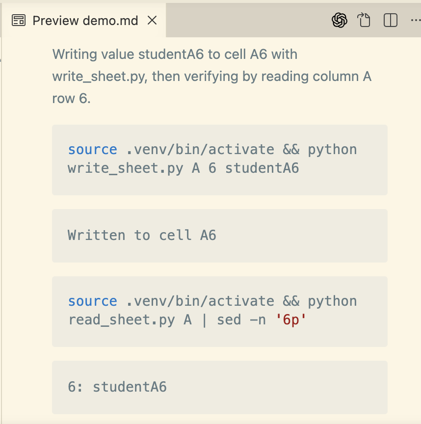

You should now have a `demo.md` file that contains real, executable examples of both scripts.

---

## 7. From Scripts to an Agent Skill

Once you have tested your scripts, you can capture them as an **Agent Skill** so that any AI assistant can use them automatically — and so that the documentation improves over time.

### What is an Agent Skill?

An **Agent Skill** is a lightweight, open format for extending an AI agent with specialised knowledge and workflows.

At its core, a skill is a folder that contains a `SKILL.md` file. That file holds metadata (at minimum a `name` and a `description`) plus instructions that tell the agent how to perform a specific task. A skill can also bundle scripts, reference documents, templates and any other resources:

```
my-skill/
├── SKILL.md          # Required: metadata + instructions
├── scripts/          # Optional: executable code
├── references/       # Optional: documentation
├── assets/           # Optional: templates, resources
└── ...               # Any additional files or directories
```

### A minimal example

VS Code looks for skills in `.agents/skills/` by default. Create the file `.agents/skills/roll-dice/SKILL.md`:

```markdown
---
name: roll-dice
description: Roll dice using a random number generator. Use when asked to roll a die (d6, d20, etc.), roll dice, or generate a random dice roll.
---

To roll a die, use the following command, which generates a random number from 1
to the given number of sides:

```bash
echo $((RANDOM % <sides> + 1))
```

```powershell
Get-Random -Minimum 1 -Maximum (<sides> + 1)
```

Replace `<sides>` with the number of sides on the die (for example, 6 for a
standard die, 20 for a d20).
```

Try it out:

1. Open the project in VS Code.
2. Open the Copilot Chat panel.
3. Select **Agent mode** in the dropdown at the bottom of the chat panel.
4. Type `/skills` to confirm that `roll-dice` appears in the list. If it does not, check that the file is at `.agents/skills/roll-dice/SKILL.md` relative to your project root.
5. Ask: *"Roll a d20."*

The agent should activate the `roll-dice` skill, ask for permission to run a terminal command, and return a random number between 1 and 20.

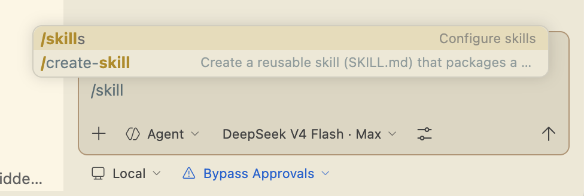

### Create the skill for our scripts

Read <https://agentskills.io/home> and <https://agentskills.io/skill-creation/quickstart> to refresh what a skill is and how to create one. Then use the `/create-skill` command to bootstrap a new skill for `read_sheet.py` and `write_sheet.py`.

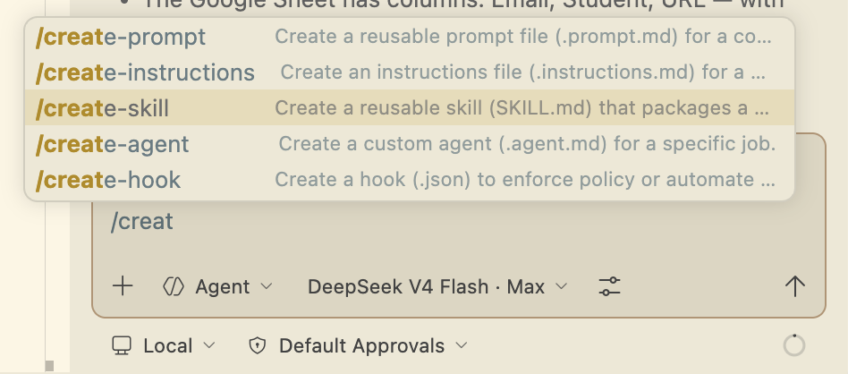

> **Prompt**
> *`/create-skill` create a new skill for reading and writing values of a Google Spreadsheet using the `read_sheet` and `write_sheet` scripts.*

### Make the skill reusable across projects

So far the skill lives in the workspace. To reuse it from any project we will move it to the user level and bundle the scripts inside it.

> **Prompt**
> *I want to be able to reuse the skill in other projects. Keep it simple. Create a `scripts/` folder. Copy there the `.py` files, the `.env`, the `service-account.json` and the `requirements.txt`. Remove the "required file layout" section from the skill. The skill is going to be used by AI agents only — there is no need to keep it human‑readable, so cut to the chase.*

This produces a user‑level skill at `~/.claude/skills/google-sheets/` that can be reused in any project:

```
~/.claude/skills/google-sheets/
├── SKILL.md          # Concise, agent‑focused instructions
└── scripts/
    ├── read_sheet.py
    ├── write_sheet.py
    ├── requirements.txt
    ├── .env
    └── service-account.json
```

Remove the previous workspace‑level copy at `.github/skills/google-sheets/`.

The new `SKILL.md` is reduced to the essentials:

- A one‑line setup command pointing at `./scripts/`.
- One‑liner CLI patterns for reading and writing.
- The scripts and `.env` are bundled in `./scripts/`, so any project can reference them via `./scripts/read_sheet.py` paths.

Finally, update `README.md` and `demo.md` to reflect the new structure.

---

## 8. Test and Refine the Skill

Open a **new** project in VS Code and run the following prompt to exercise the skill:

> **Prompt**
> *Read column A values of this spreadsheet `1mLKi6IOqcTypEKnybZPNzP9Du_nbs3g1iKFNLt2WgBM` using your `read_spreadsheet` skill.*

The skill works, but two issues become apparent:

1. The agent tries to install `requirements.txt` even though the dependencies are already installed.
2. The agent looks for `service-account.json` in the current directory instead of in the `scripts/` folder.

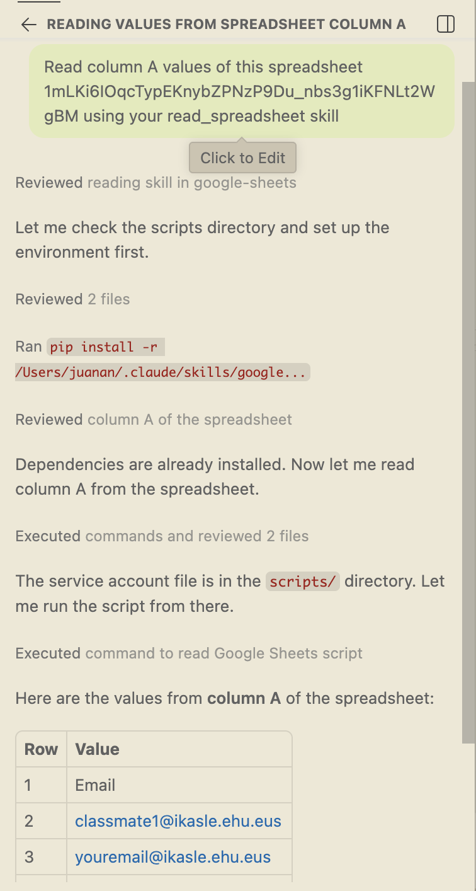

We can refine the skill to avoid these problems in the future:

> **Prompt**
> *It worked, but there were two issues:*
> *1. The agent tried to install `requirements.txt` (it was already installed).*
> *2. The agent tried to search for `service-account.json` in the current directory (it was located in the `scripts/` folder).*
> *Can you update the SKILL to avoid those issues in the future?*

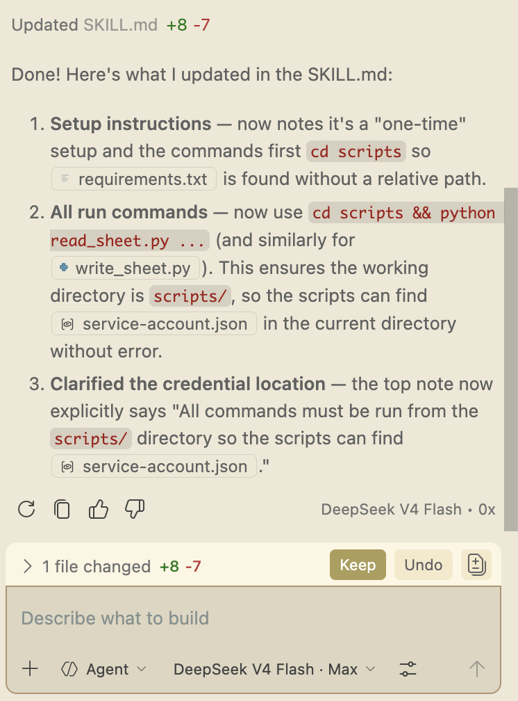

Open a **new** Copilot session and run the original prompt again:

> **Prompt**
> *Read column A values of this spreadsheet `1mLKi6IOqcTypEKnybZPNzP9Du_nbs3g1iKFNLt2WgBM` using your `read_spreadsheet` skill.*

Now it works in one shot — even with a different LLM model:

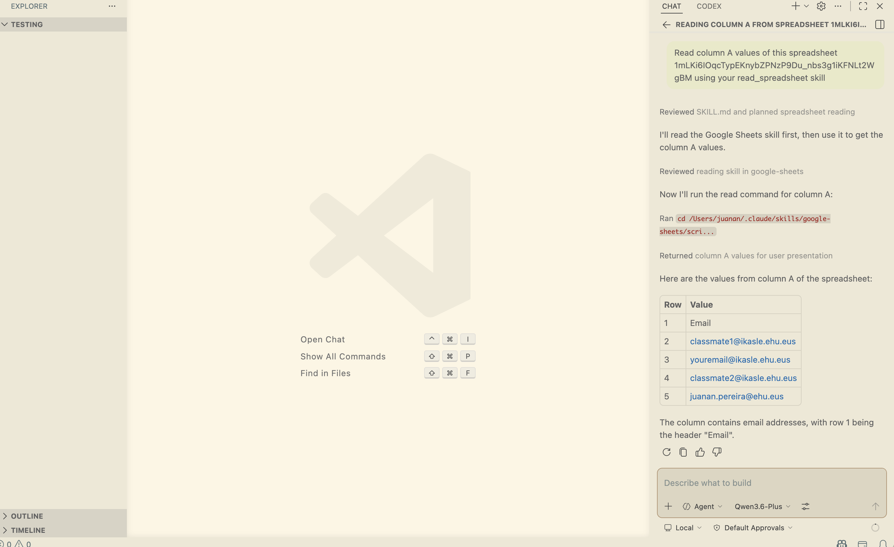

Test the writing side as well:

> **Prompt**
> *Now, using the skill, write `"test"` in cell A6.*

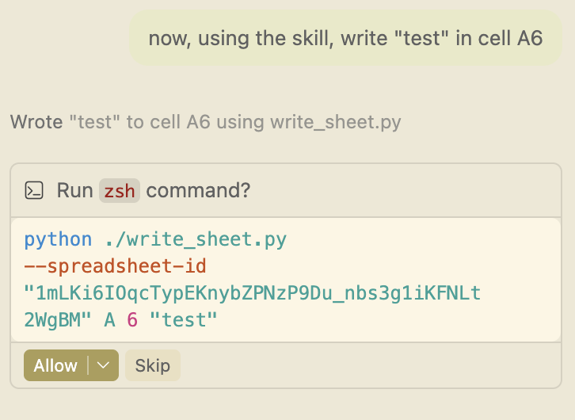

And verify the result:

> **Prompt**
> *Test that it worked by reading the same cell's value.*

---

## 9. Exercises

### Exercise 2a — Add background colours to `read_sheet.py`

Extend your script so that it also reports each cell's background colour, formatted as a hex string such as `#d9ead3` (or `null` / nothing when the cell has no colour). Include rows that are empty but have a colour set.

**Examples**

```text
$ python read_sheet.py A
1: Name
2: Alice [#d9ead3]
3: Bob
4: (empty) [#fce5cd]
5: Carol [#d9ead3]
```

```text
$ python read_sheet.py A --json
[
  {"row": 1, "value": "Name",  "background_color": null},
  {"row": 2, "value": "Alice", "background_color": "#d9ead3"},
  {"row": 3, "value": "Bob",   "background_color": null},
  {"row": 4, "value": "",      "background_color": "#fce5cd"},
  {"row": 5, "value": "Carol", "background_color": "#d9ead3"}
]
```

> 💡 **Hint:** use `worksheet.spreadsheet.fetch_sheet_metadata` with `includeGridData=True` to get the colours.

### Exercise 2b — Add background colours to `write_sheet.py`

Add a `--bg-color` option (default `#d9ead3`) that paints the cell. Make the `value` argument optional so that the script can change only the colour without overwriting the existing content.

**Examples**

```text
$ python write_sheet.py A 1 "hello"
Written to cell A1
# → A1 contains "hello", painted #d9ead3

$ python write_sheet.py A 2 "done" --bg-color "#cccccc"
Written to cell A2
# → A2 contains "done", painted gray

$ python write_sheet.py A 3 --bg-color "#ffcccc"
Written to cell A3
# → A3 keeps its existing value, painted pink
```

> 💡 **Hint:** use `worksheet.format(cell, {"backgroundColor": {...}})`. Google Sheets expects RGB components as floats in the range `0–1`.

---

## Deliverables

By the end of this lab you should have:

1. A populated `Skills` Google Spreadsheet, shared with your service account.
2. Working `read_sheet.py` and `write_sheet.py` scripts (with their `requirements.txt`).
3. A `demo.md` document generated with `showboat`.
4. A reusable, user‑level Agent Skill at `~/.claude/skills/google-sheets/` that an AI assistant can invoke without further explanation.
5. The two extensions from Exercises 2a and 2b that handle cell background colours.
